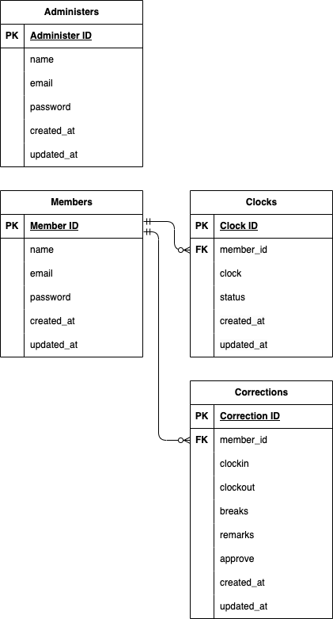

# アプリケーション名
お問い合わせフォーム

## 環境構築

Dockerビルド

	1. `git clone git@github.com:StrawberryFairyPrincess/time-and-attendance_mock.git`
	2. `docker-compose up -d --build`


Laravel環境構築

	1. `docker-compose exec php bash`
	2. `composer install`
	3. .env.exampleファイルをコピーして.envを作成
	4. .envに以下の環境変数を追加
		``` text
		DB_CONNECTION=mysql
		DB_HOST=mysql
		DB_PORT=3306
		DB_DATABASE=laravel_db
		DB_USERNAME=laravel_user
		DB_PASSWORD=laravel_pass
		```
		Mailhogの設定
		``` text
		MAIL_HOST=mail
		MAIL_PORT=1025
		MAIL_FROM_ADDRESS=info@time&attendance.com
		MAIL_FROM_NAME=退勤管理模擬案件
		```
	5. アプリケーションキーの作成
		``` bash
		php artisan key:generate
		```
	6. マイグレーションの実行
		``` bash
		php artisan migrate
		```
	7. シーディングの実行
		``` bash
		php artisan db:seed
		```


PHPUnit環境構築

	1. MySQLにログイン
		``` bash
		docker exec -it (MySQLのコンテナID) bash
		```
	2. demo_testデータベースを作る
		MySQLコンテナからMySQLにrootユーザでログイン
			``` bash
			mysql -u root -p
			```
		docker-compose.ymlのMYSQL_ROOT_PASSWORD: rootを入力
			``` bash
			root
			```
		demo_testデータベースを作る
			``` bash
			CREATE DATABASE demo_test;
			```
		ログアウト
			``` bash
			exit
			```
	3. .envファイルをコピーして.env.testingを作成
	4. .env.testingの以下の環境変数を変更
		``` text
		APP_ENV=test
		APP_KEY=
		DB_DATABASE=demo_test
		DB_USERNAME=root
		DB_PASSWORD=root
		```
	5. PHPコンテナにログイン
		```bash
		docker-compose exec php bash
		```
	6. アプリケーションキーの作成
		``` bash
		php artisan key:generate --env=testing
		```
	7. キャッシュ削除
		``` bash
		php artisan config:clear
		```
	8. テスト用テーブル作成
		``` bash
		php artisan migrate --env=testing
		```
	9. テスト実行コード
		1 認証機能（一般ユーザー）
			``` bash
			vendor/bin/phpunit tests/Feature/RegisterMemberTest.php
			```
		2 ログイン認証機能（一般ユーザー）
			``` bash
			vendor/bin/phpunit tests/Feature/LoginMemberTest.php
			```
		3 ログイン認証機能（管理者）
			``` bash
			vendor/bin/phpunit tests/Feature/LoginAdminTest.php
			```
		4 日時取得機能
			``` bash
			vendor/bin/phpunit tests/Feature/DateTest.php
			```
		5 ステータス確認機能
			``` bash
			vendor/bin/phpunit tests/Feature/StatusTest.php
			```
		6 出勤機能
			``` bash
			vendor/bin/phpunit tests/Feature/ClockInTest.php
			```
		7 休憩機能
			``` bash
			vendor/bin/phpunit tests/Feature/BreakTest.php
			```
		8 退勤機能
			``` bash
			vendor/bin/phpunit tests/Feature/ClockOutTest.php
			```
		9 勤怠一覧情報取得機能（一般ユーザー）
			``` bash
			vendor/bin/phpunit tests/Feature/ListMemberTest.php
			```
		10 勤怠詳細情報取得機能（一般ユーザー）
			``` bash
			vendor/bin/phpunit tests/Feature/DetailMemberTest.php
			```
		11 勤怠詳細情報修正機能（一般ユーザー）
			``` bash
			vendor/bin/phpunit tests/Feature/CorrectMemberTest.php
			```
		12 勤怠一覧情報取得機能（管理者）
			``` bash
			vendor/bin/phpunit tests/Feature/ListAdminTest.php
			```
		13 勤怠詳細情報取得・修正機能（管理者）
			``` bash
			vendor/bin/phpunit tests/Feature/DetailAdminTest.php
			```
		14 ユーザー情報取得機能（管理者）
			``` bash
			vendor/bin/phpunit tests/Feature/StaffAdminTest.php
			```
		15 勤怠情報修正機能（管理者）
			``` bash
			vendor/bin/phpunit tests/Feature/CorrectAdminTest.php
			```
		16 メール認証機能
			``` bash
			vendor/bin/phpunit tests/Feature/MailMemberTest.php
			```


## 使用技術(実行環境)

	・MacBook Retina, 2017
	・macOS 13.7.6
	・Laravel Framework 8.83.8
	・PHP 7.4.9
	・MySQL 8.0.26
	・nginx 1.21.1
	・Fortify 1.19
	・PHPUnit 9.5.10


## ER図




## URL

    ・開発環境：http://localhost/
    ・phpMyAdmin：http://localhost:8080/


## ログインは必要に応じて以下使用

	・管理者
		ユーザID: admin001@example.com
		パスワード: pass0001
	・一般ユーザ
		ユーザID: member001@example.com
		パスワード: pass0001
		※ログインしたら「認証メールを再送する」を押して承認を完了してください


## バリデーションメッセージについて

	一般ユーザの修正申請と管理者の修正の際の、出勤時間が退勤時間より未来にして入力した場合のバリデーションメッセージは「出勤時間もしくは退勤時間が不適切な値です」に統一